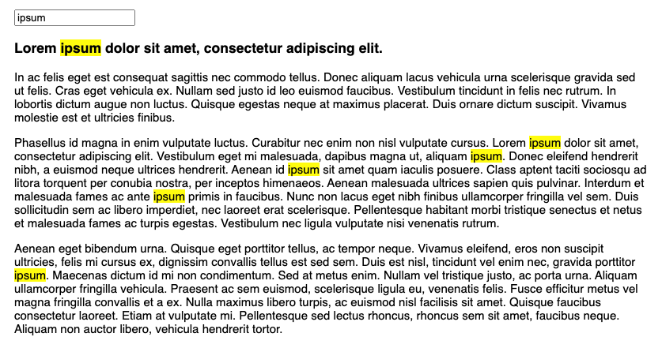

# Highlight Search Term

Highlight search term in a page. Vanilla JS, compatible with frontend frameworks (React, Vite, Angular, etc). 

[](https://marmelab.com/highlight-search-term/)

Does not modify the DOM. Relies on the browser's [CSS Custom Highlight API](https://developer.mozilla.org/en-US/docs/Web/API/CSS_Custom_Highlight_API) ([not supported by Firefox yet](https://caniuse.com/?search=CSS.Highlights)).

**Note**: This is not a syntax highlighter library. It highlights text in a page based on a search term.

## Installation

```sh
npm install highlight-search-term
```

## Usage

The library exports a single function that expects a search term and a CSS selector of the element to search in.

```js
highlightSearchTerm({ search: search.value, selector: ".content" });
```

This creates a highlight range named "search" that you can highlight with CSS, e.g.:

```css
::highlight(search) {
    background-color: yellow;
    color: black;
}
```

You can use it directly in your HTML:

```html
<script type="module">
import { highlightSearchTerm } from "https://cdn.jsdelivr.net/npm/highlight-search-term@1.0.0/src/index.js";
const search = document.getElementById("search");
search.addEventListener("input", () => {
    highlightSearchTerm({
    search: search.value,
    selector: ".content"
    });
});
</script>
```

Or, if you use a bundler like Vite, you can import it in your JavaScript:

```js
import { highlightSearchTerm } from "highlight-search-term";
const search = document.getElementById("search");
search.addEventListener("input", () => {
    highlightSearchTerm({
    search: search.value,
    selector: ".content"
    });
});
```

If you use a frontend framework like React, you can use it in a `useEffect` hook:

```jsx
import { useEffect, useState } from "react";
import { highlightSearchTerm } from "highlight-search-term";

export default function App() {
  const [search, setSearch] = useState("");
  useEffect(() => {
    highlightSearchTerm({ search, selector: ".content" });
  }, [search]);
  return (
    <div>
      <input
        type="text"
        value={search}
        onChange={(e) => setSearch(e.target.value)}
      />
      <div className="content">
        Lorem ipsum dolor sit amet, consectetur adipiscing elit.
      </div>
    </div>
  );
}
```

## License

MIT, courtesy of [Marmelab](https://marmelab.com)